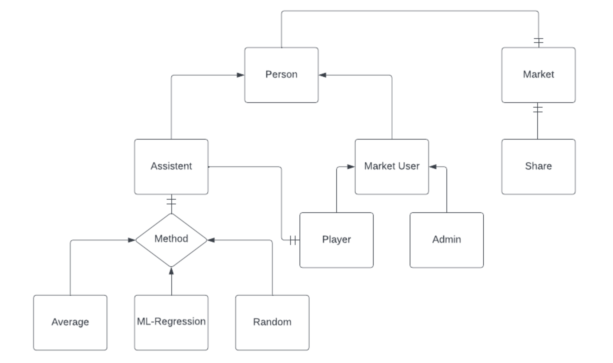

# Personal-Finance-Advisor-Solvd

## Project Description
    Welcome to financial advisor application.
    Users can input their salary, preferred currency, and desired annual interest rate.
    The system calculates the maximum loan amount they can obtain, the repayment plan,
    and the total interest paid over the loan term.

# Table of Conntents

1. [Technologies overview](#Technologies-overview)
2. [Input Data](#input-data)
    - [Endpoints](#endpoints)
      * [Login](#login)
      * [Assistant](#assistant)
      * [User](#user)
      * [Admin](#admin)
      * [Market](#market)
3. [DataBaseScheme](#data-base-scheme)
4. [Installation and Running](#installation-and-running)
    - [Install guide](#install-guide)
    - [Run guide](#run-guide)


# Technologies overview 

* Main - JavaScript
    - Node version - v20.7.0
* Framework - express
* DataBase - Sequelize, mysql
* Additional - Docker

# Input Data

Data you can provide as User to reach more percise result from my Finance Advisor

  * Salary - Monthly Income that we'll work with to give you an advice on how to manage Money

 * Currency - Wise choise of currency affects the success of investments.
  At least pay attention on: 
    - stability ( market confidence in the external value of a currency )
    - liquidity ( a currency pair's ability to be bought and sold without 
                 causing a significant change in its exchange rate )
    - reputation ( the level of trust and acceptance that a specific currency enjoys
                  among individuals, businesses, and governments )

 * Annual Interest Rate - Common practise is to divide Interest Rate
  Expectations into three categories
    - Conservative ( income < 5% )
    - Moderate ( 5% < income < 10% )
    - Aggressive ( income > 10% )

  * Assitent - Choose your Finance Advisor Worker from the list

Data you can provide as Admin to reach more realistic Market

  * Shares - Creating Shares that will be on the Market

## Endpoints

### Login
There is login page where you should provide ```username``` and ```password```
to Login or Sigh Up.
```
http://localhost:3000/login
```
REST API methods: 
 - GET '/' - starting page
 - POST '/' - route according to Role

### Assistant
Here is an ```Assistant``` that analyse and try to predict the tomorrows ```Share``` value. We use three different ```Strategies``` to predict ```Shares``` price based on price history. 
 - ML-Regression
 - Average
 - Random 
```
http://localhost:3000/assistant
```

REST API methods:
  - GET '/' - get Info to provide analyse
  - POST '/prediction' - post predictions

### User
This is ```User```. The main character in our application.
He has own ```Assistant``` to rely on. Based on ```Assistant``` advice
```User``` make a decision whether to BUY or SELL some ```Shares```.
```
http://localhost:3000/user
```

REST API methods:
 - GET '/' - navigation panel
 - GET '/:userId/assistant-prediction' - look through Assistant prediction
 - POST '/:userId/assistant' - choose assistant
 - POST '/:userId/buy-share/:shareId - buy Share
 - POST '/:userId/summary' - Display Summary on Succession Rate 
 - PUT '/:userId/sell-share/:shareId - sell Share

### Admin
There is ```Admin``` that allows to manage ```Market``` and ```Users``` Membership.
```
http://localhost:3000/admin
```
REST API methods:
 - GET '/' - navigation panel
 - PUT '/share' - create new Share
 - DELETE '/:id' - delete User

### Market
This is the ```Market``` instance. It stores active ```Users```, ```Shares``` and their history.
```
http://localhost:3000/market
```
REST API methods:
 - GET '/' - navigation panel
   * GET '/users' - get all active Users
   * GET '/shares' - get all existing Shares
   * GET '/share/:name' - get info about specific Share
 - PUT '/shares' - generate new share values
 - PUT '/day' - move onto the next day

# Data Base Scheme



# Installation and Running:

## Install guide

Clone the repo -> Get in to the project folder -> Install Dependencies
```
git clone git@github.com:timosheyka/Personal-Finance-Advisor-Solvd.git
```
```
cd Personal-Finance-Advisor-Solvd
```
```
npm install
```

## Run guide
```
node index.js
```